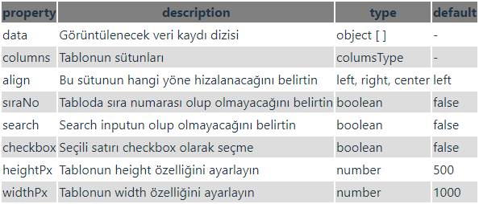

# tables7 NPM package

React vite kullanarak oluşturmuş olduğum STable komponenti

**API Table**



**Install**

`npm i tables7                                                       `

**Usage**

`import STable from "tables7/src/STable"                             `

```
const usersData = [
    {
      key: "1",
      name: "John Brown",
      age: 32,
      address: "New York No. 1 Lake Park",
      tags: "nice",
    },
    {
      key: "2",
      name: "Jim Grees",
      age: 42,
      address: "London No. 1 Lake Park",
      tags: "loser",
    },
    {
      key: "3",
      name: "Joe Black",
      age: 32,
      address: "Sydney No. 1 Lake Park",
      tags: "cool",
    },
  ]

  const columns = [
    {
      title: "Name",
      dataIndex: "name",
      key: "name",
    },
    {
      title: "Age",
      dataIndex: "age",
      key: "age",
    },
    {
      title: "Address",
      dataIndex: "address",
      key: "address",
    },
    {
      title: "tags",
      dataIndex: "tags",
      key: "tags",
      render: (_, column) => (
        <div style={{ backgroundColor: "red" }}>{column.tags} </div>
      ),
    },
    {
      title: "action",
      dataIndex: "action",
      render: (cellData, column) => (
        <button onClick={() => console.log("column", column)}>tıkla</button>
      ),
    },
  ];

```

```
    <STable
    data={users}
    columns={columns}
    />
```
